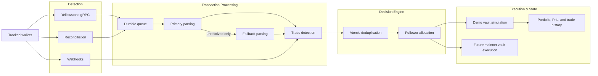

  

<h1 align="center">Stellalpha</h1>

  <strong>High-fidelity, non-custodial capital allocation layer for Solana.</strong>

  <a href="https://stellalpha.xyz">App Portal</a>
  ·
  <a href="https://stellalpha.xyz/whitepaper.pdf">Technical Whitepaper</a>
  ·
  <a href="https://dorahacks.io/buidl/32072">DoraHacks</a>
  ·
  <a href="https://github.com/akm2006/stellalpha_vault">Vault Infrastructure</a>
  ·
  <a href="https://x.com/stellalpha_">X Protocol</a>

  
  
  
  

Stellalpha is an **intent-based, non-custodial capital allocation layer** on Solana. Moving beyond naive wallet mirroring, Stellalpha replicates **"trade intent"** by automatically adjusting execution based on relative portfolio weights and curated strategy models.

Built on a low-latency dual-ingestion engine (**Yellowstone gRPC + Helius**) and a custom **Rust parser**, it provides the secure infrastructure needed for stablecoin capital to follow high-signal on-chain traders without surrendering custody.

---

## 🛠 Technical Moat: The Execution Engine

Stellalpha is engineered for professional reliability, solving the latency and parsing challenges that kill traditional copy-trading platforms.

- **High-Performance Rust Parser:** Our custom `carbon-parser` decodes complex SVM instructions at the source, normalizing trades from Jupiter, Raydium, and Meteora into a unified "Intent Model."
- **Dual-Ingestion Pipeline:** Powered by **Yellowstone gRPC** for ultra-low latency signature detection and **Helius Enhanced Webhooks** for high-fidelity data reconciliation.
- **Intent-Based Strategy Synthesis:** Instead of replaying fixed dollar amounts, we replicate **Strategic Intent**. If a leader sells 10% of their holdings, Stellalpha executes a proportional 10% exit within the follower's secure vault.
- **The Strategy Registry:** A curated suite of proprietary execution models (Balanced Hybrid, Trader Ratio, Fixed %) designed to match specific trader profiles and risk appetites.

---

## 🧱 The Infrastructure Stack

- **Core Logic:** Rust (Carbon-core), TypeScript (Next.js 15, React 19)
- **Data Ingestion:** Yellowstone gRPC (Chainstack/PublicNode), Helius Webhooks
- **DeFi Execution:** Jupiter SDK & API (Routing, Quotes, and Simulation)
- **Control Plane:** Redis (Upstash/Railway), Supabase (PostgreSQL & Auth)
- **Deployment:** Railway (Distributed Ingestion Workers), Docker

---

## The Thesis

Most copy trading systems are built around wallet mirroring. That works in a lab, but it breaks down in production:
- **Liquidity Crushing:** Naive mirroring creates demand spikes that erode alpha through massive slippage.
- **Portfolio Drift:** Follower balances never perfectly match leaders, leading to disproportionate risk.
- **Execution Latency:** Multi-second delays are fatal on high-velocity Solana tokens.

Stellalpha's model is simple: **Replicate the trade decision, not the raw transaction.**

By using stablecoin capital as the strategy base and replicating intent-weights, we ensure clearer follower accounting and a robust path to institution-ready strategy infrastructure.

---

## What Is Live Today

- **High-Fidelity Demo Activation:** A risk-free environment initialized with **$1,000.00 virtual capital** to verify strategy logic.
- **Star Trader Curation:** Performance-focused leaderboard for browsing curated Solana wallets and their historical "Intent Patterns."
- **Horizontal Strategy Registry:** Seamless discovery of proprietary execution models tailored to different alpha styles.
- **Real-time Technical Readouts:** Live performance logs, sub-second latency benchmarks, and transparent vault state tracking.

---

## Real-Time Ingestion Path

---

## Mainnet Vault Integration

Stellalpha's intended mainnet architecture is centered on **`stellalpha_vault`**, an on-chain layer built using Anchor to turn simulated trades into real, non-custodial execution.

The model uses a **Vault -> Trader State** architecture:
- Users own a base vault that holds their USDC capital.
- Following a trader creates a dedicated **Trader State** PDA.
- Stellalpha receives **delegated execution authority**, constrained to specific policy envelopes (e.g., "Jupiter-only," "Max 5% slippage").

---

## 🏁 Technical Verification Guide

To verify the **Intent-Based** engine in action:
1. **Connect Wallet:** Sign in to [stellalpha.xyz](https://stellalpha.xyz) via phantom, solflare or social auth.
2. **Initialize Demo Vault:** This allocates 1,000 virtual USDC for strategy testing.
3. **Select a Star Trader:** Pick a proven performer and review the recommended copy model.
4. **Monitor Execution:** Watch the dashboard as the gRPC engine detects trades and executes proportional intent replication.
5. **Code Audit:** Inspect the `carbon-parser/` directory for the Rust decoding logic and `lib/copy-models/` for the allocation math.

---

  Built in public for the Solana ecosystem.

