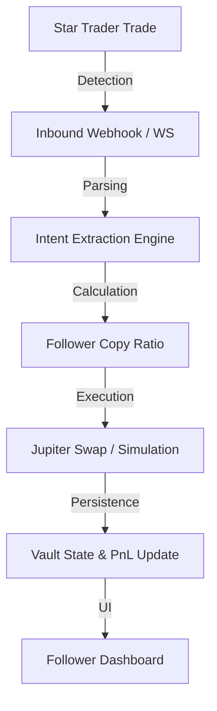

# Stellalpha: Autonomous Non-Custodial Copy Trading on Solana

[](https://opensource.org/licenses/MIT)
[](https://nextjs.org/)
[](https://solana.com/)
[](https://jup.ag/)

Stellalpha is a next-generation DeFi infrastructure layer on Solana that enables users to automatically follow top traders and replicate their strategies using a **non-custodial, intent-based execution engine**.

Unlike traditional copy trading systems that mirror raw token movements, Stellalpha mirrors **trade intent (allocation weight)** — enabling more reliable, scalable, and capital-efficient execution.

---

## 🚀 Why Stellalpha?

On-chain copy trading today suffers from balance desynchronization, slippage mismatches, and latency-driven execution failures. Stellalpha solves this by introducing **Intent-based trade replication**.

> **Intent-based trade replication instead of raw transaction copying**

- **Consistent Execution**: Strategies scale across different portfolio sizes seamlessly.
- **Reduced Failure Rates**: Smart routing and slippage enforcement minimize broken trades.
- **Accurate PnL Tracking**: Real-time weighted average cost analysis for followers.

---

## ✨ Key Features

- **🛡️ Automated Copy Trading**: Follow any wallet and replicate trades using a weight-based allocation model.
- **🔐 Non-Custodial Architecture**: User funds are secured via PDA-based vaults (Stellalpha Vault) on-chain.
- **💵 USDC-Centric Model**: Designed for stablecoin-based capital allocation and predictable performance.
- **🪐 Jupiter Integration**: Uses Jupiter for optimized swap routing and high-fidelity simulation.
- **⚡ Real-Time Detection**: Powered by Chainstack WebSockets with Helius backup and reconciliation.
- **🏎️ Fast Onboarding**: Deploy a demo vault and follow your first trader in under 60 seconds.
- **🌐 Flexible Auth**: Supports Wallet signatures (SIWS), Google, X, and GitHub via Reown (AppKit).

---

## 🏗️ How It Works



1. **Detect**: Monitor "Star Traders" via low-latency WebSocket logs or Helius webhooks.
2. **Parse**: Heuristic analysis filters out MEV and router noise to extract true trade intent.
3. **Compute**: Calculate the appropriate copy ratio based on the follower's specific allocation.
4. **Execute**: Submit swaps via Jupiter (Mainnet) or estimate output via Quotes (Demo).
5. **Update**: Real-time state synchronization for positions, inventory, and realized PnL.

---

## 🧪 Demo Vault System (Active)

Experience the power of Stellalpha without financial risk:
- **Seed Capital**: Every user starts with **1,000 virtual USDC**.
- **Real-Time Simulation**: Trades use live Jupiter quotes for high-fidelity execution.
- **Full Metrics**: Track positions, allocations, and PnL exactly as they would appear on-chain.

---

## 🛠️ Getting Started

### Prerequisites
- [Node.js 20+](https://nodejs.org/)
- [PnPM](https://pnpm.io/)
- [Supabase Account](https://supabase.com/)

### Installation
1. Clone the repository:
   ```bash
   git clone https://github.com/akm2006/stellalpha.git
   cd stellalpha
   ```
2. Install dependencies:
   ```bash
   pnpm install
   ```
3. Setup environment variables:
   ```bash
   cp .env.example .env.local
   # Add your HELIUS_API_KEY, SUPABASE_URL, etc.
   ```
4. Run the development server:
   ```bash
   pnpm dev
   ```

### Running the Worker
To start the real-time WebSocket ingestion worker:
```bash
pnpm worker
```

---

## 🗺️ Roadmap

- [x] Copy Trading Engine v2 (Intent-based)
- [x] Demo Vault Simulation System
- [ ] Deploy Stellalpha Vault on Solana Mainnet
- [ ] Enable Real Capital Copy Trading
- [ ] Institutional-grade Risk Controls (KYC/KYT)
- [ ] Ultra-low latency migration (Helius LaserStream)

---

## 🏆 Hackathon Context

Stellalpha was built for **StableHacks 2026**, focusing on institutional-grade DeFi infrastructure:
- **Stablecoin Focus**: Native USDC-centric allocation model.
- **Security First**: Permissioned vault designs and gas abstraction.
- **Transparency**: Audit-friendly execution logs and real-time monitoring.

---

## 🔗 Links

- **Application**: [stellalpha.xyz](https://stellalpha.xyz)
- **Whitepaper**: [Download PDF](https://stellalpha.xyz/whitepaper.pdf)
- **Vault Contract**: [stellalpha_vault](https://github.com/akm2006/stellalpha_vault)
- **Twitter**: [@stellalpha_](https://x.com/stellalpha_)

---

## 📄 License
Distributed under the MIT License. See `LICENSE` for more information.
