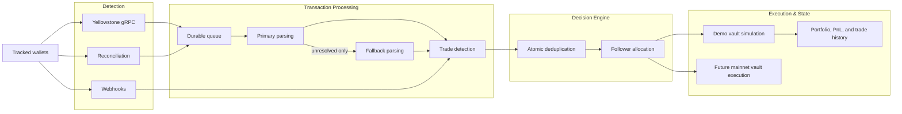

  

<h1 align="center">Stellalpha</h1>

  <strong>Autonomous, non-custodial capital allocation infrastructure for Solana.</strong>

  <a href="https://stellalpha.xyz">App</a>
  ·
  <a href="https://stellalpha.xyz/whitepaper.pdf">Whitepaper</a>
  ·
  <a href="https://dorahacks.io/buidl/32072">DoraHacks</a>
  ·
  <a href="https://github.com/akm2006/stellalpha_vault">Vault Repo</a>
  ·
  <a href="https://x.com/stellalpha_">X</a>

  
  
  
  
  

Stellalpha is a non-custodial execution layer designed to replicate **trade intent** instead of raw transaction data. By moving beyond naive wallet mirroring, Stellalpha enables stablecoin capital to follow high-signal on-chain traders with institutional-grade risk alignment and sub-second execution.

The project is the result of 6 months of heavy engineering focused on solving the "balance desynchronization" problem—where traditional copy-bots cause followers to take disproportionate risk compared to the leader. Stellalpha's engine interprets a trader's allocation weight and executes a proportional trade within the follower's secure vault environment.

---

## 🛠 Technical Moat: The Execution Engine

Stellalpha is engineered for professional reliability, solving the latency and parsing challenges that kill traditional copy-trading platforms.

- **High-Performance Rust Parser:** Our custom `carbon-parser` (built on the [Carbon](https://github.com/sevenlabs-hq/carbon) framework) decodes complex SVM instructions at the source, normalizing trades from Jupiter, Raydium, and Meteora into a unified "Intent Model."
- **Dual-Ingestion Pipeline:** Powered by **Yellowstone gRPC** for ~200ms signature detection and **Helius Enhanced Webhooks** for high-fidelity data reconciliation.
- **Atomic Deduplication:** A Redis-backed control plane ensures that only the fastest ingestion source "claims" a trade for execution, preventing costly double-trades.
- **Adaptive Allocation Models:** Instead of replaying fixed dollar amounts, we replicate **Allocation Weight**. If a leader sells 10% of their SOL, Stellalpha sells 10% of the follower's SOL, preserving strategy fidelity across any wallet size.

---

## 🧱 The Infrastructure Stack

- **Core Logic:** Rust (Carbon-core), TypeScript (Next.js 15, React 19)
- **Data Ingestion:** Yellowstone gRPC (Chainstack/PublicNode), Helius Webhooks
- **DeFi Execution:** Jupiter SDK & API (Routing, Quotes, and Simulation)
- **Control Plane:** Redis (Upstash/Railway), Supabase (PostgreSQL & Auth)
- **Deployment:** Railway (Distributed Ingestion Workers), Docker

---

## The Thesis

Most copy trading systems are built around wallet mirroring. That works in a lab, but it breaks down in production:
- **Portfolio Drift:** Follower balances never perfectly match leaders.
- **Execution Latency:** 2-second delays cause massive slippage on high-velocity tokens.
- **Accounting Mess:** Replaying 100 small trades creates complex tax and tracking nightmares.

Stellalpha's model is simple: **Replicate the trade decision, not the raw transaction.**

By using stablecoin capital as the strategy base and replicating intent-weights, we ensure clearer follower accounting and a robust path to institution-ready strategy infrastructure.

---

## What Is Live Today

- **Intent-Based Simulation Engine:** A high-fidelity environment validated over 6 months that uses real-time market data to prove the weight-based replication thesis.
- **Star Trader Discovery:** Performance-focused leaderboard for browsing curated Solana wallets and their historical "Intent Patterns."
- **Real-time Ingestion Stack:** Yellowstone gRPC backend provides sub-second trade detection.
- **Trader Detail Surfaces:** Deep-dive analytics into wallet-level holdings and follower-facing PnL context.
- **Stale-Signal Protection:** Asymmetric execution policy that skips BUYs older than 10s but ensures SELLs are always fulfilled to protect exits.

---

## Real-Time Ingestion Path

---

## Mainnet Vault Integration

Stellalpha's intended mainnet architecture is centered on **`stellalpha_vault`**, an on-chain layer built using Anchor to turn simulated trades into real, non-custodial execution.

The model uses a **Vault -> Trader State** architecture:
- Users own a base vault that holds their USDC capital.
- Following a trader creates a dedicated **Trader State** PDA.
- Stellalpha receives **delegated execution authority**, constrained to specific policy envelopes (e.g., "Jupiter-only," "Max 5% slippage").

---

## 🏁 Technical Verification Guide

To verify the **Intent-Based** engine in action:
1. **Connect Wallet:** Sign in to [stellalpha.xyz](https://stellalpha.xyz) via Phantom or Solflare.
2. **Create Demo Vault:** This initializes 1,000 virtual USDC for strategy testing.
3. **Follow a Star Trader:** Select a high-activity wallet from the leaderboard.
4. **Monitor Execution:** Watch the dashboard as the gRPC engine detects trades and calculates the **Copy Ratio** based on your vault's relative size.
5. **Code Audit:** Inspect the `carbon-parser/` directory for the Rust decoding logic and `lib/copy-models/` for the allocation math.

---

  Built in public for the Solana ecosystem.

