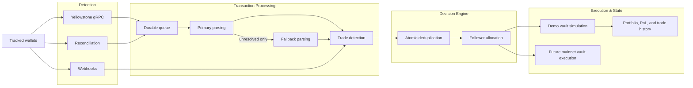

  

<h1 align="center">Stellalpha</h1>

  <strong>Autonomous, non-custodial copy trading for stablecoin capital on Solana.</strong>

  <a href="https://stellalpha.xyz">App</a>
  ·
  <a href="https://stellalpha.xyz/whitepaper.pdf">Whitepaper</a>
  ·
  <a href="https://dorahacks.io/buidl/32072">DoraHacks</a>
  ·
  <a href="https://github.com/akm2006/stellalpha_vault">Vault Repo</a>
  ·
  <a href="https://x.com/stellalpha_">X</a>

  
  
  
  

Stellalpha is building a new execution layer for allocating stablecoin capital to high-signal on-chain traders without giving up custody. Instead of copying raw wallet movements, Stellalpha interprets **trade intent** and translates it into follower-specific execution.

The core idea is simple: users should be able to deploy capital from a stablecoin-native base while keeping the capital path non-custodial, transparent, and programmable. The current public app demonstrates that experience through a live-market **demo vault**. The long-term product is a real non-custodial vault system for production execution on Solana.

This repository is public because Stellalpha is being built in public. It is meant to communicate product direction, progress, and architecture at a high level, not to function as a self-hosting or deployment repository.

---

## The Thesis

Most copy trading systems are built around wallet mirroring.

That works in a demo, but it breaks down in practice:

- follower portfolios do not match leader portfolios
- execution timing drifts between users
- routes and fills change in real markets
- accounting becomes messy when every wallet has a different state

Stellalpha is built around a different model:

> **Replicate the trade decision, not the raw transaction.**

For Stellalpha, that starts with stablecoin capital sitting inside a user-controlled vault and being deployed through trader-following logic rather than through raw wallet replay.

That means:

- **non-custodial capital**
- **stablecoin-denominated allocation**
- **intent-based replication**
- **allocation-aware sizing**
- **clearer follower accounting**
- **a cleaner path to institution-ready strategy infrastructure**

---

## What Makes Stellalpha Different

- **Non-custodial by design**  
  Stellalpha is being built around dedicated user vaults rather than pooled or exchange-style custody.

- **Stablecoin-native capital model**  
  The product is designed around stablecoin capital as the base layer for allocation, accounting, and future treasury-style workflows.

- **Intent-based execution**  
  The system focuses on what a trader did and how much exposure they expressed, not on replaying every token movement literally.

- **Follower-specific allocation logic**  
  Execution is adapted to the follower's capital and configured allocation instead of assuming every account should behave identically.

- **Simulation before real capital**  
  The public product validates the user experience, execution flow, and portfolio accounting with realistic simulation before enabling live vault execution.

- **Infrastructure-first product direction**  
  Stellalpha is closer to execution infrastructure than a social trading app. The leaderboard is the surface; the product is the engine behind follower execution.

- **Built for institution-ready capital flows**  
  The combination of non-custodial vaults, stablecoin-denominated capital, and explicit execution logic creates a stronger foundation for professional and institutional use cases.

---

## What Is Live Today

- **Star Trader discovery**  
  Public pages for browsing tracked Solana wallets, recent activity, and performance context.

- **Trader detail surfaces**  
  Wallet-level trade history, holdings context, and follower-facing performance views.

- **Demo Vault**  
  A live-market simulation environment where users allocate virtual stablecoin capital and follow traders without real financial risk.

- **Real-time ingestion stack**  
  Yellowstone gRPC provides the sub-second backend detection path, with webhook delivery and reconciliation adding parallel delivery and recovery.

- **Portfolio and PnL simulation**  
  Position tracking, trade history, and portfolio updates based on live market conditions.

The current public experience is **simulation**, not live capital execution.

---

## Real-Time Ingestion Path

1. **Yellowstone gRPC** is the lowest-latency backend path for tracked-wallet activity, giving Stellalpha a sub-second ingestion path for trade detection.
2. **Webhook delivery** provides a parallel path, while **reconciliation** continuously backfills anything that was missed.
3. **Queued signatures** move through a durable transaction-processing path with a primary parser and a bounded fallback path for unresolved transactions.
4. **Trade detection** normalizes the payload into a common trade intent model before it reaches the decision engine.
5. **Atomic deduplication** ensures only the first source that claims a signature advances it into follower logic.
6. **Follower allocation and staleness rules** then drive demo-vault simulation today and prepare the path for future non-custodial vault execution.

The stale-signal policy is intentionally asymmetric:

- **BUY signals older than 10 seconds are skipped** because entering a fast-moving meme coin late can be worse than not entering at all.
- **SELL signals are still executed even when delayed** because exiting late is still better than never exiting.

---

## Product Shape

Stellalpha currently spans two connected layers:

- **Public application layer**  
  Discovery, trader pages, and the demo vault experience.

- **Execution layer**  
  A real-time ingestion and decision stack built around Yellowstone gRPC, webhook delivery, a durable parsed-transaction queue, provider-aware trade detection, atomic deduplication, and explicit stale-signal handling before follower execution.

That separation is intentional. The app proves the user experience and execution logic first. The vault system becomes the production capital layer when the product is ready.

---

## Mainnet Vault Integration

Stellalpha's intended mainnet architecture is centered on **`stellalpha_vault`**, the on-chain vault layer being built to turn the demo-vault experience into real, non-custodial execution.

The model is a **vault -> trader states** architecture:

- each user owns a base vault that holds their capital
- each selected trader gets a dedicated **trader state**
- the vault holds the capital base, while trader states isolate per-trader allocation, sync state, execution, settlement, and exit

That structure is what lets Stellalpha combine automated execution with a strong non-custodial boundary. In the intended production model, Stellalpha receives **delegated execution authority**, but only inside a tightly scoped strategy envelope:

- execution is intended to be **policy-constrained**, not arbitrary
- swaps are intended to be **Jupiter-only**, not open-ended external execution
- withdrawals remain **owner-controlled**
- the protocol should be able to execute the strategy, but not take custody of the principal

This aligns directly with the product shown in the app today. The current demo vault already models the same follower lifecycle Stellalpha wants to enforce on-chain: allocate capital, follow a selected trader, track positions and PnL, pause when needed, settle back to the base asset, and exit cleanly.

The intended non-custodial permission split looks like this:

| Capability | Vault owner | Stellalpha execution authority | What the boundary means |
| --- | --- | --- | --- |
| Create the vault and assign delegated execution authority | Yes | No | The user defines the trust boundary. |
| Deposit or add capital to the vault | Yes | No | Stellalpha cannot pull funds into custody. |
| Withdraw or redeem principal back to the owner wallet | Yes | No | Only the owner can take capital out. Stellalpha cannot redeem, withdraw, or drain user funds. |
| Pause or stop strategy activity | Yes | Yes | Both sides can trigger the safety stop, but pausing is not the same as having withdrawal rights. |
| Open, close, settle, and exit trader states | Yes | No | The user controls which strategy allocations exist and when they end. |
| Execute approved Jupiter swaps inside active trader states | No* | Yes | Stellalpha gets execution power, not custody power. |
| Send funds to an arbitrary external wallet | No | No | Principal should stay inside the vault and trader-state policy envelope. |

\* Unless the owner is also set as the delegated authority. In Stellalpha's intended production model, execution authority is delegated to the protocol while withdrawal authority remains exclusively with the owner.

In other words, the public app demonstrates **how Stellalpha behaves**, and `stellalpha_vault` is the mainnet capital layer being developed to enforce that same behavior on-chain.

Vault repo: [stellalpha_vault](https://github.com/akm2006/stellalpha_vault)

---

## Current Status

- The **public app is live in demo form**.
- The **current follower experience is simulated** using live market data, real trader activity, and stablecoin-denominated demo capital.
- The **real non-custodial vault layer is being developed separately** and will be integrated after the demo-vault flow is fully validated.

This is why Stellalpha can already demonstrate the core product narrative today while still being honest about what is and is not live on-chain.

---

## Roadmap

- [x] Public star-trader discovery
- [x] Demo vault for simulated copy trading
- [x] Real-time multi-source trade ingestion
- [x] Portfolio and PnL simulation
- [ ] Non-custodial vault integration
- [ ] Live capital execution
- [ ] Risk controls and permissions
- [ ] Institution-ready reporting and operations

---

## Links

- **App**: [stellalpha.xyz](https://stellalpha.xyz)
- **Whitepaper**: [stellalpha.xyz/whitepaper.pdf](https://stellalpha.xyz/whitepaper.pdf)
- **DoraHacks**: [dorahacks.io/buidl/32072](https://dorahacks.io/buidl/32072)
- **Vault repo**: [stellalpha_vault](https://github.com/akm2006/stellalpha_vault)
- **X**: [@stellalpha_](https://x.com/stellalpha_)

---

## License

Distributed under the MIT License. See `LICENSE` for more information.
